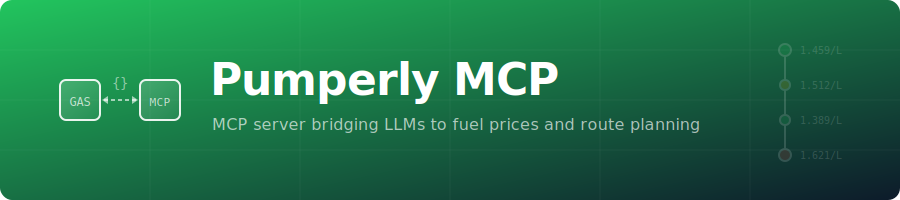

<p align="center">
  
</p>

<h1 align="center">Pumperly-MCP</h1>

<p align="center">
  <a href="https://codecov.io/gh/GeiserX/pumperly-mcp"></a>
  <a href="https://www.npmjs.com/package/pumperly-mcp"></a>
  
  <a href="https://hub.docker.com/r/drumsergio/pumperly-mcp"></a>
  <a href="https://github.com/GeiserX/pumperly-mcp/stargazers"></a>
  <a href="https://github.com/GeiserX/pumperly-mcp/blob/main/LICENSE"></a>
</p>
<p align="center">
  <a href="https://registry.modelcontextprotocol.io"></a>
  <a href="https://glama.ai/mcp/servers/GeiserX/pumperly-mcp"></a>
  <a href="https://mcpservers.org/servers/geiserx/pumperly-mcp"></a>
  <a href="https://mcp.so/server/pumperly-mcp"></a>
  <a href="https://github.com/toolsdk-ai/toolsdk-mcp-registry"></a>
  <a href="https://github.com/punkpeye/awesome-mcp-servers#readme"></a>
</p>

<p align="center"><strong>A tiny bridge that exposes any Pumperly instance as an MCP server, enabling LLMs to query real-time fuel prices, find stations, plan routes, and geocode locations.</strong></p>

---

## What you get

| Type          | What for                                                       | MCP URI / Tool id                |
|---------------|----------------------------------------------------------------|----------------------------------|
| **Resources** | Browse configuration, statistics, and exchange rates read-only | `pumperly://config`<br>`pumperly://stats`<br>`pumperly://exchange-rates` |
| **Tools**     | Find stations, calculate routes, and geocode locations          | `find_nearest_stations`<br>`get_stations_in_area`<br>`calculate_route`<br>`find_route_stations`<br>`geocode` |

Everything is exposed over a single JSON-RPC endpoint (`/mcp`).
LLMs / Agents can: `initialize` -> `readResource` -> `listTools` -> `callTool` ... and so on.

---

## Quick-start (Docker Compose)

```yaml
services:
  pumperly-mcp:
    image: drumsergio/pumperly-mcp:latest
    ports:
      - "127.0.0.1:8080:8080"
    environment:
      - PUMPERLY_URL=https://pumperly.com
```

> **Security note:** The HTTP transport listens on `127.0.0.1:8080` by default. If you need to expose it on a network, place it behind a reverse proxy with authentication.

## Install via npm (stdio transport)

```sh
npx pumperly-mcp
```

Or install globally:

```sh
npm install -g pumperly-mcp
pumperly-mcp
```

This downloads the pre-built Go binary from GitHub Releases for your platform and runs it with stdio transport. Requires at least one [published release](https://github.com/GeiserX/pumperly-mcp/releases).

## Local build

```sh
git clone https://github.com/GeiserX/pumperly-mcp
cd pumperly-mcp

# (optional) create .env from the sample
cp .env.example .env && $EDITOR .env

go run ./cmd/server
```

## Configuration

| Variable       | Default                  | Description                                      |
|----------------|--------------------------|--------------------------------------------------|
| `PUMPERLY_URL` | `https://pumperly.com`   | Pumperly instance URL (without trailing /)       |
| `LISTEN_ADDR`  | `127.0.0.1:8080`         | HTTP listen address (Docker sets `0.0.0.0:8080`) |
| `TRANSPORT`    | _(empty = HTTP)_         | Set to `stdio` for stdio transport               |

Put them in a `.env` file (from `.env.example`) or set them in the environment.

## Testing

Tested with [Inspector](https://modelcontextprotocol.io/docs/tools/inspector) and it is currently fully working. Before making a PR, make sure this MCP server behaves well via this medium.

## Example configuration for client LLMs

```json
{
  "schema_version": "v1",
  "name_for_human": "Pumperly-MCP",
  "name_for_model": "pumperly_mcp",
  "description_for_human": "Query real-time fuel prices, find stations, plan routes, and geocode locations via Pumperly.",
  "description_for_model": "Interact with a Pumperly instance that aggregates fuel station data. First call initialize, then reuse the returned session id in header \"Mcp-Session-Id\" for every other call. Use readResource to fetch URIs that begin with pumperly://. Use listTools to discover available actions and callTool to execute them.",
  "auth": { "type": "none" },
  "api": {
    "type": "jsonrpc-mcp",
    "url":  "http://localhost:8080/mcp",
    "init_method": "initialize",
    "session_header": "Mcp-Session-Id"
  },
  "logo_url": "https://pumperly.com/logo.png",
  "contact_email": "acsdesk@protonmail.com",
  "legal_info_url": "https://github.com/GeiserX/pumperly-mcp/blob/main/LICENSE"
}
```

## Credits

[Pumperly](https://pumperly.com) -- real-time fuel price aggregation

[MCP-GO](https://github.com/mark3labs/mcp-go) -- modern MCP implementation

[GoReleaser](https://goreleaser.com/) -- painless multi-arch releases

## Maintainers

[@GeiserX](https://github.com/GeiserX).

## Contributing

Feel free to dive in! [Open an issue](https://github.com/GeiserX/pumperly-mcp/issues/new) or submit PRs.

Pumperly-MCP follows the [Contributor Covenant](http://contributor-covenant.org/version/2/1/) Code of Conduct.

## Other MCP Servers by GeiserX

- [cashpilot-mcp](https://github.com/GeiserX/cashpilot-mcp) — Passive income monitoring
- [duplicacy-mcp](https://github.com/GeiserX/duplicacy-mcp) — Backup health monitoring
- [genieacs-mcp](https://github.com/GeiserX/genieacs-mcp) — TR-069 device management
- [lynxprompt-mcp](https://github.com/GeiserX/lynxprompt-mcp) — AI configuration blueprints
- [telegram-archive-mcp](https://github.com/GeiserX/telegram-archive-mcp) — Telegram message archive

## Related Projects

| Project | Description |
|---------|-------------|
| [Pumperly](https://github.com/GeiserX/Pumperly) | Open-source fuel and EV route planner with real-time prices |
| [Pumperly-android](https://github.com/GeiserX/Pumperly-android) | Official Android app for Pumperly fuel and EV route planner |
| [pumperly-ha](https://github.com/GeiserX/pumperly-ha) | Home Assistant custom integration for Pumperly fuel and EV charging prices |
| [n8n-nodes-pumperly](https://github.com/GeiserX/n8n-nodes-pumperly) | n8n community node for Pumperly fuel and EV charging data |
